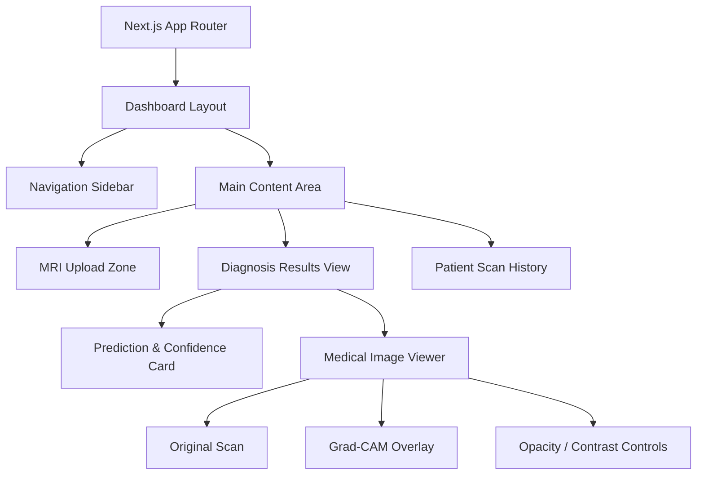

# Frontend Architecture: Brain Tumor Detection Web App

This document outlines a production-ready frontend architecture to replace the Streamlit prototype. It is designed for a clinical or research environment, requiring high performance, security, and a premium user experience.

## 1. High-Level Tech Stack

For a responsive, dynamic, and accessible medical imaging application, we recommend a modern JavaScript ecosystem:

- **Framework:** Next.js (React) — Provides server-side rendering (SSR) for fast initial loads and secure API routing.
- **Styling:** Tailwind CSS + shadcn/ui — For a clean, accessible, and highly customizable design system.
- **State Management:** Zustand — Lightweight and easy to use for managing global state (e.g., user sessions, current MRI scan).
- **Data Fetching:** TanStack Query (React Query) — Handles caching, retries, and background updates when communicating with the AI backend.
- **Backend / API Layer:** FastAPI (Python) — Next.js will communicate with a FastAPI microservice that runs the PyTorch model and Grad-CAM logic.

---

## 2. Component Hierarchy

The application UI is divided into modular, reusable React components.

---

## 3. Data Flow & API Integration

Because PyTorch models are heavy, the frontend and AI backend should be decupled.

1. **User Upload:** The user drags and drops a `.dcm` (DICOM) or `.png` MRI scan into the `<UploadZone />` component.
2. **Next.js API Route:** The frontend securely sends the file to a Next.js Server Action / API Route to avoid exposing the backend directly.
3. **FastAPI Backend:** Next.js forwards the image to the Python FastAPI microservice.
4. **Inference:** The FastAPI server runs `phase1` preprocessing, `phase4` ResNet50 inference, and `phase5` Grad-CAM generation.
5. **Response:** FastAPI returns JSON containing:
   - `predicted_class`: e.g., "glioma"
   - `confidences`: `{ glioma: 98.2, meningioma: 1.5, ... }`
   - `overlay_image`: Base64 encoded Grad-CAM overlay image.
6. **Frontend Render:** TanStack Query updates the React state, instantly rendering the `<PredictionCard />` and the visual explanation in the `<Viewer />`.

---

## 4. Key Frontend Features

### Interactive DICOM / Image Viewer
Medical apps require specialized image viewing. We will use a library like **Cornerstone.js** or a custom HTML5 Canvas implementation to allow users to:
- Zoom and pan the MRI scan.
- Adjust windowing (brightness/contrast) which is standard in radiology.
- Use a slider to adjust the transparency (alpha blend) of the Grad-CAM heatmap over the original scan.

### Real-Time Confidence Charts
Instead of static images, the confidence scores will be rendered using **Recharts** to create beautiful, animated, and interactive horizontal bar charts.

### Patient History & Caching
Using **Zustand** and **TanStack Query**, the app will cache previous uploads in the current session. Radiologists can quickly toggle back and forth between different scans without needing to wait for the model to re-run inference.

---

## 5. Security & Compliance Considerations (HIPAA)

Since this deals with medical data (PII/PHI):
- **No Client-Side Storage:** Avoid storing unanonymized MRI scans in `localStorage`.
- **Transmission Security:** All requests between Next.js and FastAPI must be encrypted via HTTPS/TLS 1.3.
- **Ephemeral Processing:** If building for production, the FastAPI server should be configured to process the image in memory and immediately delete it, rather than writing to disk.
